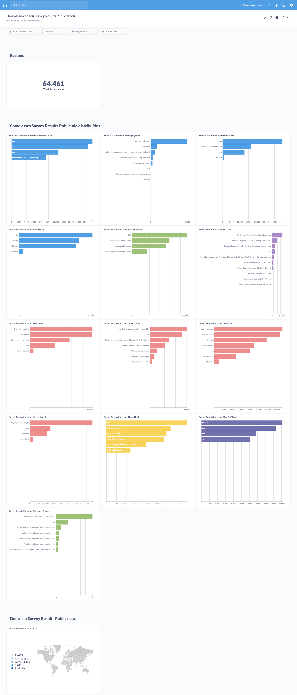

# desafio-3
As regras e requisitos do desafio 3:
1. Montar uma infra no docker (Metabase + Banco (MySQL ou PostGreSQL)).
2. Subir conjunto de dados (alguns exemplos no fim).
3. Criar uma dashboard para apresentação.
4. O projeto precisa estar no Github para checagem.

# Como utilizar
Baixe o projeto com o git 
```bash
$ git clone https://github.com/zerossB/desafio-3.git
```

Depois execute o docker com o comando
```bash
$ docker-compose up
```

Abra seu navegador e acesse a url `http://localhost:3000`

# Print do Dashboard
